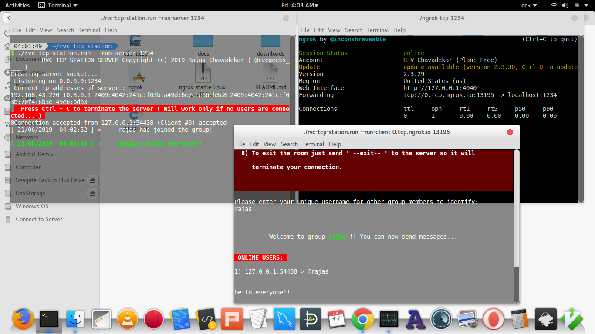
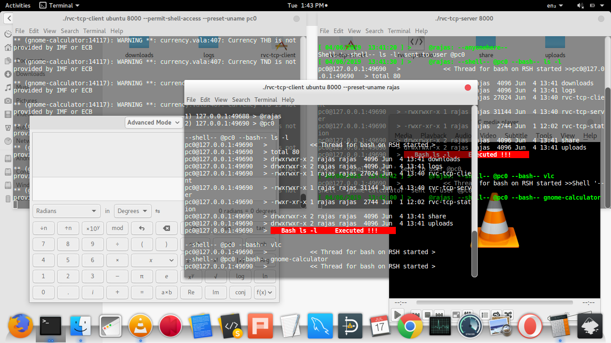
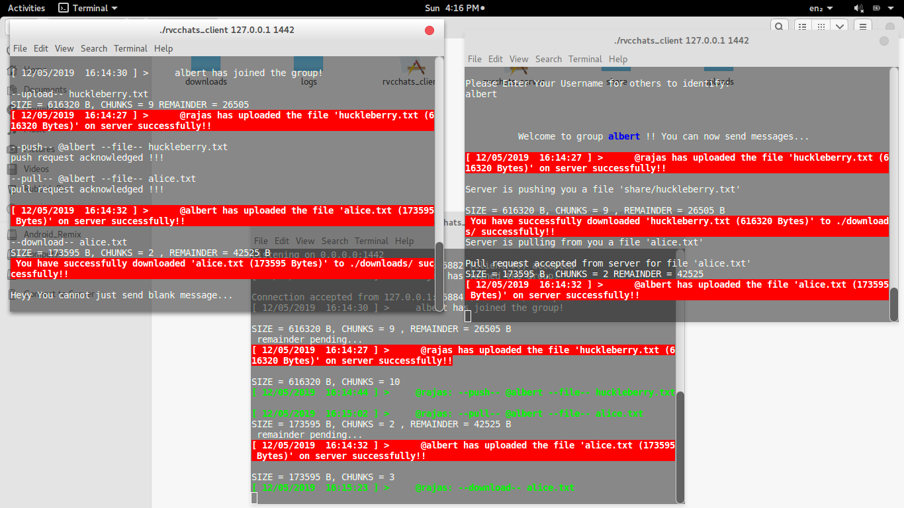

# Rvc TCP Station

An all in one TCP server client system in Linux
1) Multi user TCP/IP chat
2) Multithreaded RSH (Remote Shell control)
3) Checksum safe FTP (File transfer protocol)

## Internal Architecture


## Getting Started

These instructions will get you a copy of the project up and running on your local machine for development and testing purposes. See deployment for notes on how to deploy the project on a live system.

### Prerequisites

However this project is built on Ubuntu 16.04 LTS so
the release for this project can work on any 64 bit Debian distributions.
However we are planning to create a configuration for Windows in further releases

On the OS you need:
1) gnu make
2) g++ >= 5.4.0 with libpthread.so
3) tar archiver

### Compilation

It has a make script so in terminal so just run

```
make
```
This will create a self executing compressed archive "rvc-tcp-station.run"
Copy this file on different computers and use client and server accordingly

To compile server and client binary without creating the run archive,
you can make these targets separately as

```
make server; make client
```

## Deployment

Please note that the folders for ftp (uploads , downloads, share, logs) will be created 
in the directory where 'rvc-tcp-station.run' was launched.

We have an intuitive and interactive script that will launch the client automatically. For that run

```
./rvc-tcp-station.run
```
running the binary without arguments will start the launcher script.
On the terminal of PC you have decided to keep as server run rvc-tcp-server

```
./rvc-tcp-station.run --run-server (port no)
```
The clients can connect via your hostname so you can give a unique host name
by running the following command as Root:
```
hostname (your custom hostname)
```
However its will restore to defaults if server reboots.
To show your current hostname just run above command with no arguments.

On any PC where you have to open the client,

```
./rvc-tcp-station.run --run-client (hostname/ip address of server) (port no) -reconnect --permit-shell-access --preset-uname (client username)
```
where --permit-shell-access flag is optional enabling any user to execute shell commands on your PC 
and --preset-uname sets username without stdin in commandline itself it is also optional
--reconnect will make server connection automatically after 60 seconds even on exit. This
flag must be only given if --no-console is given i.e. you are intending to execute a hidden client.
for best results on hidden client execute it as boot process described as the following...
 The order of flags donot matter at all .. application will understand it
but specify the username after --preset-uname flag if given.


One can also set the client as a startup service via this script 
to uninstall the client from startup service (if exist) just send -u flag to this script
to do it in single commandline itself
```
./rvc-tcp-station.run -u
```
If you want to completely and remotely uninstall the client from remote pc, on RSH of victim in your client program you can send command
```
--shell-- @(victim uname) --bash-- init; (path to the script)/rvc-tcp-station -u
```
So 'init' will cause the connection to terminate and immediately the uninstall is carried out
You will never need to fear what if other user shuts down without leaving the group, will the threads 
be damaged? will the network get destroyed? absolutely no as we have caught SIGTERM at the client side and 
have gracefully closed the ongoing connection with proper --exit-- request to server. SIGTERM is sent by OS to 
running applications to give them a chance to execute cleanup and their own exit routines .. we have just made use 
of it. So by these all features of client a hidden remote control of deploy and forget type can be implemented. 
Atleast for now, server does not have this feature as it may be serving multiple clients and
exit request is from client side. To do this we have to first close every other client connnected to it that too with proper exit
requests and then leaving the port ... One can contribute in adding this feature however. 

How is hidden client implemented:

The --no-console flag tells the client not to take any input message instead to execute the server
listening process in main thread itself instead of creating a separate thread for that. this fixes the cpu utilization for waiting 
for user input (stdin) and just follows the server... This flag is mandatory else the stdin (tty input) process suspends
and whole system goes in race on exiting the terminal.
after "disown" you can even close the client terminal but the program continues to interact with server at the background 
as the terminal loses the authority over the application it will keep running until server sends --getout-- bash to the client
This enables hidden PC remote control.

### Worldwide Deployment

Unlike the normal servers generally http, this server can serve only its clients as it may not or may give invalid response.
So to make it public you either can use a router NAT port forwarding from your router settings or use a dns service that
provides raw tcp data transfer what suits to you.  
As we have used gethostbyname client can connect the host

We had successfully tested this application with 'ngrok'
1) Create an account woth ngrok and follow their steps for installation and port forwarding. [Check their site](https://ngrok.com/download) 
2) Launch rvc-tcp-station server at say port X (>1024) 
3) Launch ngrok in plain tcp mode 
```
./ngrok tcp X
```
where X is port where you have launched rvc-tcp-server
4) Gert the hostname and port no Y from ngrok and use them to connect other rvc-tcp-clients

## Instructions

1) Just type the message and press enter to send your message.
2) To upload a file first copy it in your 'uploads folder created by app' and 
   then in your chats send command '--upload-- yourfilename' to server to send
   it on group.. everyone in that group will be able to download that file.
3) To download a file in the group send the command '--download-- filename' to
   server and after successful download it will appear in your 
   'downloads' folder. Please accurately mention the filename. 
4) To execute a scell command on a user who permits one's shell access , use
   '--shell-- @[username |--all--] --bash-- [actual commandline to execute]'
   in the actual command if you give '--getout--' it will just terminate 
   the client connection. If it fails you will get some error message.
   But remember that only one user at a given time can send shell command! 
5) The --pull-- command delibrately uploads a file from client side onto the 
   server. It will command the client program to upload prescribed file. 
   '--pull-- @[username] --file-- [accurate filename]' is its syntax. 
6) Similar is with --push-- command but the opposite action to command the 
   client to download the prescribed file from server. 
   '--push-- @[username |--all--] --file-- [accurate filename]' is its syntax.
7) To view all online users type command '--anyonehere--'. You will get a list
   of all available users with their ip address.
8) To exit the room just send ' --exit-- ' to the server so it will
   terminate your connection.


## Signal handling

### User level signals:
1) SIGINT  (ctrl + 'c')
2) SIGTSTP (ctrl + 'z')
3) SIGQUIT (ctrl + '\\')
<br>
Server ignores above signals if any client is online, else terminated.<br>
Client ignores above signals by default.

### Fatal termination signals:
1) SIGKILL
2) SIGABRT
3) SIGTERM
<br>
Server closes all active connections and threads and terminates on above signals.<br>
Client closes connection with server and listner thread and terminates on above signals.

## Operation Screenshots

Launcher Script


Connection with ngrok port forwarding for worldwide connection


Multithreaded Remote Shell


Upload and Download


Push Pull request


Hidden Remote control


Remote Shutdown


## Author

* **Rajas Chavadekar** 

## License

This project is licensed under the MIT License - see the [LICENSE](LICENSE) file for details

